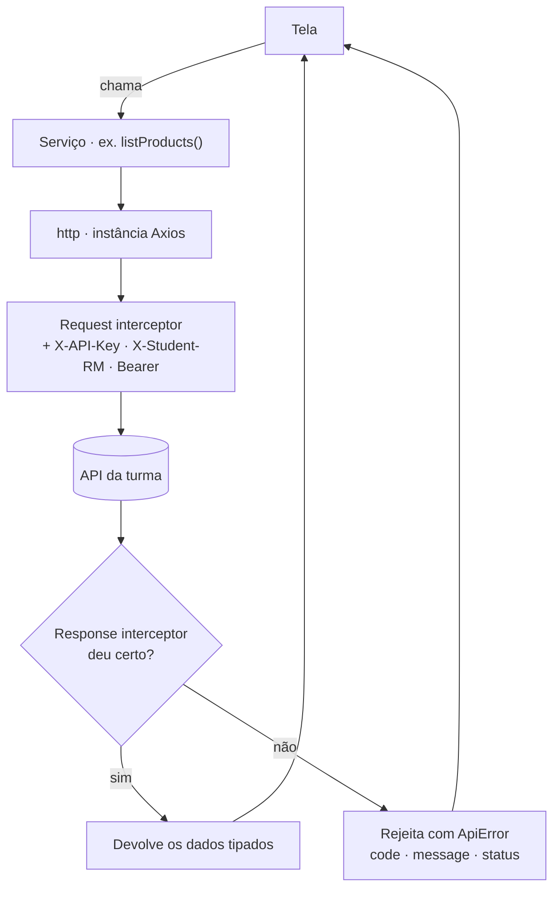

Na primeira semana montamos a base de tudo que vem depois: uma **camada de serviços** em
Axios que centraliza **como** o app conversa com a API da turma — instância única,
headers automáticos, injeção de token e **tratamento de erro num lugar só**.

> **A ideia da semana:** nenhuma tela chama `axios` direto. A tela pede a um **serviço**;
> o serviço sabe falar com a API. Assim, quando algo muda (URL, header, erro), muda **num
> arquivo só**.

<!-- truncate -->

## Por que não chamar a API direto na tela

Se cada tela montar sua própria requisição, a gente repete headers, repete `try/catch`,
repete o jeito de ler o erro — e no dia que a API muda, caça-se `fetch` por todo o app. A
camada de serviços resolve isso: **um** cliente HTTP configurado, e funções tipadas por
cima dele.

## O que construímos

### 1. A instância HTTP — `src/services/http.ts`

Um cliente Axios com `baseURL`, `timeout` e os **headers que vão em toda requisição**:
`X-API-Key` (identifica o grupo) e `X-Student-RM` (rastreia quem está codando — isso conta
na avaliação).

```ts
export const http = axios.create({
  baseURL: `${env.apiUrl}/v1`,
  timeout: 15000,
  headers: {
    'Content-Type': 'application/json',
    'X-API-Key': env.apiKey,
    'X-Student-RM': env.studentRm,
  },
});
```

### 2. Interceptor de request — o token entra sozinho

O comprador loga e recebe um token. Em vez de lembrar de anexá-lo em cada chamada, um
**interceptor** injeta o `Authorization: Bearer` quando existe token, e o remove quando não:

```ts
let customerToken: string | null = null;
export function setCustomerToken(token: string | null) { customerToken = token; }

http.interceptors.request.use((config) => {
  if (customerToken) config.headers.set('Authorization', `Bearer ${customerToken}`);
  else config.headers.delete('Authorization');
  return config;
});
```

### 3. Interceptor de response — **um** tratamento de erro para o app inteiro

Aqui está o pulo do gato da semana: toda falha vira um **`ApiError`** com `code`,
`message` e `status`. A tela nunca precisa cavar `error.response.data.error` — ela recebe
um erro previsível e tipado.

```ts
http.interceptors.response.use(
  (response) => response,
  (error) => {
    const status = error.response?.status ?? 0;
    const payload = error.response?.data?.error;
    if (payload) return Promise.reject(new ApiError(payload.code ?? 'ERROR', payload.message ?? 'Erro na API', status));
    if (error.code === 'ECONNABORTED') return Promise.reject(new ApiError('TIMEOUT', 'A requisição demorou demais.', status));
    return Promise.reject(new ApiError('NETWORK_ERROR', 'Sem conexão com o servidor. Confira a URL da API.', status));
  },
);
```

O caminho de uma requisição, de ponta a ponta:



### 4. Serviços tipados por recurso

Por cima da instância, funções pequenas e **tipadas** — a tela pede o dado, não sabe de HTTP:

```ts
// src/services/products.ts
export async function listProducts(params: ListProductsParams = {}): Promise<Paginated<ProductSummary>> {
  const { data } = await http.get<Paginated<ProductSummary>>('/products', { params });
  return data;
}
export async function getProduct(id: string): Promise<Product> {
  const { data } = await http.get<Product>(`/products/${id}`);
  return data;
}
```

Também deixamos prontos `cart.ts` (`getCart`, `addCartItem`, `updateCartItem`,
`removeCartItem`) e `auth.ts` (`login`, `register`) — todos no mesmo padrão.

### 5. Os tipos da API — `src/types/api.ts`

`Paginated<T>`, `ProductSummary`, `Product` (com `variants[]`), `Cart`, e a classe
`ApiError`. Tipar aqui é o que faz o autocomplete funcionar no app inteiro e mata o `any`.

## As telas (consumindo "na mão")

Com os serviços prontos, as telas de **lista** e **detalhe** buscam com `useState` +
`useEffect`, tratando loading/erro na unha. O carrinho ficou como **placeholder**.

Funciona — mas repare em quanta coisa a tela gerencia:

```tsx
const [produtos, setProdutos] = useState<ProductSummary[]>([]);
const [loading, setLoading] = useState(true);
const [erro, setErro] = useState<string | null>(null);

useEffect(() => {
  let vivo = true;
  listProducts()
    .then((res) => vivo && setProdutos(res.data))
    .catch((e) => vivo && setErro(e.message))
    .finally(() => vivo && setLoading(false));
  return () => { vivo = false; };
}, []);
```

> **Gancho para a Semana 2:** guardem essa sensação de "gerenciar dado na mão". É
> exatamente isso que o **TanStack Query** vem aposentar — cache, revalidação e estados
> prontos. A camada de serviços continua; o Query só orquestra o que ela já faz.

## Regras de ouro (valem o semestre todo)

- **A unidade vendável é a VARIANTE.** Carrinho usa `variantId`; preço/estoque vêm em
  `product.variants[]` (no detalhe), não na listagem.
- **Headers sempre:** `X-API-Key` e `X-Student-RM`. Rotas de comprador exigem também o
  `Authorization: Bearer` (que o interceptor injeta).
- **Sem `any`** sem justificativa documentada — é penalidade nos checkpoints.

## Lembretes de API

- Base: `http://localhost:3333/v1`. Documentação viva (Swagger) em `/docs`.
- URL por plataforma: emulador Android = `http://10.0.2.2:3333`; celular físico =
  `http://SEU_IP:3333`; simulador iOS/web = `http://localhost:3333`.
