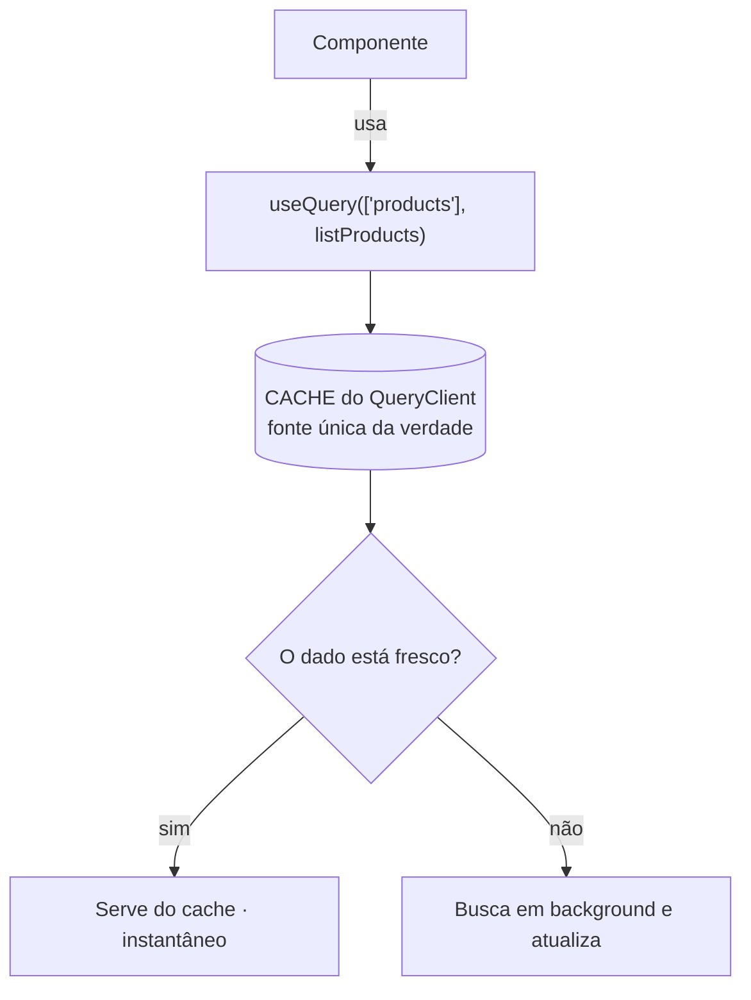
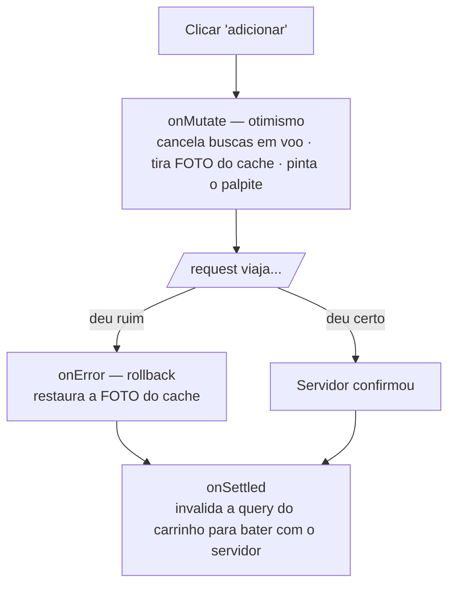

Hoje começamos a **Semana 2 — Consumo e Integração com API · pt. 2**. Construímos direto
sobre a camada de serviços (Axios) da Semana 1 e adicionamos o **TanStack Query**: cache,
revalidação e mutations otimistas.

> **A frase da semana:** na Semana 1 a gente aprendeu a **buscar** dados. Nesta semana a
> gente para de **cuidar** deles na mão.

<!-- truncate -->

## Por que trocar `useEffect` + `useState`

Partimos da tela da Semana 1 que busca produtos manualmente:

```tsx
// Funciona — mas repare em quanta coisa a gente gerencia:
const [produtos, setProdutos] = useState<ProductSummary[]>([]);
const [loading, setLoading] = useState(true);
const [erro, setErro] = useState<string | null>(null);

useEffect(() => {
  let vivo = true;
  setLoading(true);
  listProducts()
    .then((res) => vivo && setProdutos(res.data))
    .catch((e) => vivo && setErro(e.message))
    .finally(() => vivo && setLoading(false));
  return () => { vivo = false; };
}, []);
```

Três dores que ficaram no ar (guarde-as — o Query mata as três):

1. A **mesma** busca em 3 telas = **3 requests**, mesmo com dado idêntico.
2. Voltar para uma tela já visitada mostra **spinner de novo**.
3. Aquele `let vivo = true` existe só para não dar `setState` em componente desmontado.

## O modelo mental (só três ideias)



- **Query = leitura**, identificada por uma **key**. A key é o "endereço" do dado no cache.
- **staleTime** = por quanto tempo o dado é "fresco". Fresco **não** refaz request.
- **Mutation = escrita** (POST/PATCH/DELETE). Depois de escrever, a gente **invalida** a
  leitura para ela se atualizar.

## O que escrevemos ao vivo

**1. O `QueryClient`** — `src/lib/queryClient.ts`, com `staleTime` e um `retry` que **não**
repete em 4xx (401/404/422 não melhoram com retry).

**2. O provider** — envolvemos o app com `<QueryClientProvider>` no `App.tsx`. **A ordem
importa:** o Query fica **por fora** do `SessionProvider`, porque a sessão usa `useQueryClient`.

**3. A primeira query** — trocamos a tela da retomada por um hook:

```tsx
// src/hooks/useProducts.ts
export function useProducts(params = {}) {
  return useQuery({
    queryKey: ['products', 'list', params], // os params ENTRAM na key
    queryFn: () => listProducts(params),
  });
}

// na tela:
const { data, isLoading, isError, error, refetch } = useProducts();
```

Rodamos e fizemos o teste: entrar no produto, voltar para a lista → **não pisca spinner**
(veio do cache). Foi o momento "uau" do dia.

**4. Query keys** — a lição que evita 80% dos bugs do semestre:

> Quem **lê** e quem **invalida** têm que usar a **mesma** key. Se um usa `['products']` e o
> outro `['product']`, a invalidação não acontece — e você jura que "o Query está bugado".
> Não está: a key não bateu.

A key inclui os `params` de busca — procurar "camisa" e "tênis" são **dois caches** distintos.

**5. Mutation + atualização otimista** — o ápice. O ciclo de uma escrita otimista:



Mostramos os dois caminhos:

- **Feliz:** clicar em "adicionar" → o item aparece no carrinho **na hora**, antes da resposta.
- **Triste:** com o backend fora, o item aparece e **some** (rollback). Isso é honestidade de
  UI: mostramos o otimismo, mas não mentimos quando falha.

> **Detalhe que separa nota 7 de nota 10:** para pintar o item otimista precisamos de `name` e
> `unitPrice` **na mão** — o servidor tem, mas ainda não recebemos a resposta. Por isso a
> mutation recebe esses campos. Otimismo custa um pouquinho de dado local.

## Mão na massa (em aula)

Cada grupo, no próprio app, **migrou a tela de listagem para `useProducts`**: lista via
`useQuery`, com `isLoading` e `isError` tratados. O erro nº 1 foi **esquecer o
`QueryClientProvider`** — se a sua lista não carregou, comece por aí.

## 📌 Dever de casa (segunda → quarta) · ~40 min

Entregar no **início da aula de quarta (12/08)**. Feito no app do seu grupo, consumindo a API
da turma. Use o `X-Student-RM` de **quem está codando** — isso conta na avaliação.

1. **Instale e ligue o Query.** `npm i @tanstack/react-query`. Envolva o app com
   `<QueryClientProvider>` usando um `QueryClient` criado em arquivo próprio.
2. **Migre a listagem** para `useProducts()` com `useQuery`. A tela trata `isLoading`
   (spinner), `isError` (mensagem + botão de tentar de novo) e a **lista vazia**.
3. **Busca:** ligue um `TextInput` de busca que faça **parte da query key**
   (`['products','list',{ search }]`). Buscas diferentes viram caches diferentes; voltar a
   uma busca já feita é instantâneo.
4. **Responda em 2 linhas no README do grupo:** ao digitar rápido no campo de busca, quantas
   requests saem e por quê? (Dica: `staleTime` e `placeholderData`.)

**Critério de pronto:** lista carrega via `useQuery`; **sem** `useEffect`/`useState` para
data/loading/erro na tela; a busca reflete na query key.

## Quarta — carrinho e mutations (o código completo)

Venham com a lista **já migrada**. A quarta é o código do carrinho, em três blocos.

### Bloco 1 — `useProduct(id)` + adicionar ao carrinho

O detalhe é uma query de **um** item. Lembre: preço e estoque vivem em `variants[]`.

```ts title="src/hooks/useProduct.ts"
import { useQuery } from '@tanstack/react-query';
import { getProduct } from '@/services/products';
import { queryKeys } from '@/lib/queryKeys';

export function useProduct(id: string) {
  return useQuery({
    queryKey: queryKeys.products.detail(id),
    queryFn: () => getProduct(id),
    enabled: Boolean(id), // não dispara com id vazio
  });
}
```

Na tela de detalhe, escolhemos a variante e disparamos a mutation de adicionar:

```tsx title="src/screens/ProductDetailScreen.tsx (essencial)"
const { data: product } = useProduct(id);
const { addItem } = useCartMutations();
const [variantId, setVariantId] = useState<string | null>(null);

// variante escolhida (ou a default/primeira quando o produto chega)
const selected = useMemo(() => {
  if (!product) return undefined;
  return product.variants.find((v) => v.id === variantId)
    ?? product.variants.find((v) => v.isDefault)
    ?? product.variants[0];
}, [product, variantId]);

function handleAdd() {
  if (!product || !selected) return;
  addItem.mutate(
    {
      variantId: selected.id,
      quantity: 1,
      name: selected.label ? `${product.name} (${selected.label})` : product.name,
      unitPrice: selected.price, // dado local que o otimismo precisa
    },
    { onSuccess: () => navigation.navigate('Cart') },
  );
}
```

### Bloco 2 — `useCart()` dependente de login

A rota `/cart` exige o token do comprador — então a query só dispara **logado**
(`enabled: isLoggedIn`).

```ts title="src/hooks/useCart.ts"
import { useQuery } from '@tanstack/react-query';
import { getCart } from '@/services/cart';
import { queryKeys } from '@/lib/queryKeys';
import { useSession } from '@/session/session';

export function useCart() {
  const { isLoggedIn } = useSession();
  return useQuery({
    queryKey: queryKeys.cart.all,
    queryFn: getCart,
    enabled: isLoggedIn, // sem login não roda (evita 401)
  });
}
```

### Bloco 3 — `useCartMutations` com atualização otimista

O coração da semana. As três mutations (adicionar, mudar quantidade, remover) seguem o
mesmo ciclo `onMutate` → `onError` → `onSettled`. Repare no `cancelQueries`, na **foto**
(`previous`) e no `setQueryData` com um objeto **novo** (imutabilidade).

```ts title="src/hooks/useCartMutations.ts"
import { useMutation, useQueryClient } from '@tanstack/react-query';
import { addCartItem, removeCartItem, updateCartItem } from '@/services/cart';
import { queryKeys } from '@/lib/queryKeys';
import type { Cart } from '@/types/api';

const EMPTY_CART: Cart = { id: 'optimistic', items: [], total: 0, itemCount: 0 };

/** Recalcula total e itemCount a partir dos itens (mantém o Cart coerente). */
function recompute(items: Cart['items']): Cart {
  const total = items.reduce((sum, it) => sum + it.subtotal, 0);
  const itemCount = items.reduce((sum, it) => sum + it.quantity, 0);
  return { id: EMPTY_CART.id, items, total, itemCount };
}

export function useCartMutations() {
  const queryClient = useQueryClient();
  const key = queryKeys.cart.all;

  // rollback + reconciliação, reaproveitados pelas 3 mutations
  const rollbackOnError = (_e: unknown, _v: unknown, ctx?: { previous?: Cart }) => {
    if (ctx?.previous) queryClient.setQueryData(key, ctx.previous);
  };
  const settle = () => queryClient.invalidateQueries({ queryKey: key });

  // Adicionar — precisa de name/unitPrice para DESENHAR o item otimista
  const addItem = useMutation({
    mutationFn: (v: { variantId: string; quantity: number; name: string; unitPrice: number }) =>
      addCartItem(v.variantId, v.quantity),
    async onMutate(v) {
      await queryClient.cancelQueries({ queryKey: key });     // 1. trava buscas em voo
      const previous = queryClient.getQueryData<Cart>(key);   // 2. foto do cache
      const base = previous ?? EMPTY_CART;
      const existing = base.items.find((it) => it.variantId === v.variantId);
      const items = existing
        ? base.items.map((it) =>
            it.variantId === v.variantId
              ? { ...it, quantity: it.quantity + v.quantity, subtotal: it.unitPrice * (it.quantity + v.quantity) }
              : it)
        : [...base.items, {
            variantId: v.variantId, name: v.name, sku: '',
            unitPrice: v.unitPrice, quantity: v.quantity, subtotal: v.unitPrice * v.quantity,
          }];
      queryClient.setQueryData<Cart>(key, recompute(items));  // 3. otimismo
      return { previous };                                    // 4. contexto p/ rollback
    },
    onError: rollbackOnError,
    onSettled: settle,
  });

  // Mudar quantidade (0 remove)
  const setQuantity = useMutation({
    mutationFn: (v: { variantId: string; quantity: number }) => updateCartItem(v.variantId, v.quantity),
    async onMutate(v) {
      await queryClient.cancelQueries({ queryKey: key });
      const previous = queryClient.getQueryData<Cart>(key);
      const base = previous ?? EMPTY_CART;
      const items = base.items
        .map((it) => it.variantId === v.variantId ? { ...it, quantity: v.quantity, subtotal: it.unitPrice * v.quantity } : it)
        .filter((it) => it.quantity > 0);
      queryClient.setQueryData<Cart>(key, recompute(items));
      return { previous };
    },
    onError: rollbackOnError,
    onSettled: settle,
  });

  // Remover item
  const removeItem = useMutation({
    mutationFn: (variantId: string) => removeCartItem(variantId),
    async onMutate(variantId) {
      await queryClient.cancelQueries({ queryKey: key });
      const previous = queryClient.getQueryData<Cart>(key);
      const base = previous ?? EMPTY_CART;
      const items = base.items.filter((it) => it.variantId !== variantId);
      queryClient.setQueryData<Cart>(key, recompute(items));
      return { previous };
    },
    onError: rollbackOnError,
    onSettled: settle,
  });

  return { addItem, setQuantity, removeItem };
}
```

**O entregável do dia é o rollback:** com o backend fora, adicionar um item mostra ele na
hora e depois o **remove** sozinho (o `onError` restaura a foto). Isso é honestidade de UI.

:::danger Os 4 erros que mais aparecem aqui
- Esquecer `await cancelQueries` no `onMutate` → uma busca em voo chega depois e apaga o otimismo.
- Não retornar `{ previous }` → o `onError` não tem o que restaurar.
- Mutar o array do cache (`items.push`) em vez de criar um novo → React não re-renderiza.
- Otimismo sem `name`/`unitPrice` → o item aparece "quebrado".
:::

## Lembretes de API

- **Base (nuvem):** `https://api.mockmerce.com.br/v1` — os apps conectam no backend na
  nuvem, não em `localhost`. Swagger em `https://api.mockmerce.com.br/docs`.
- Headers sempre: `X-API-Key` (grupo) e `X-Student-RM` (rastreio). Rotas de comprador exigem
  também `Authorization: Bearer`.
- **Unidade vendável = variante.** Carrinho/checkout usam `variantId`; preço/estoque vivem em
  `variants[]`.
