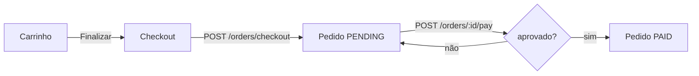

Hoje começamos a **Semana 3 — Checkout e Pedidos**. Até agora o app enchia o carrinho e
parava num "Finalizar" que não fazia nada. Nesta semana ele passa a **deixar comprar**:
checkout → pagamento (simulado) → pedido → histórico. É o pedaço que faltava para o app ser
"de ponta a ponta" — o coração do **CP1**.

> **A frase da semana:** otimismo é pra micro-interação, **não pra dinheiro**. O carrinho a
> gente pinta na hora; o pagamento a gente **espera** o servidor confirmar.

<!-- truncate -->

## Parte A — a auth que já veio pronta (leitura rápida)

O app já abre numa tela de **Login** e tem uma **guarda de rotas**. Isso não é o conteúdo
novo — mas entenda o chão em que pisamos. A guarda troca o app inteiro conforme o estado:

```tsx title="App.tsx"
function RootNavigator() {
  const { isLoggedIn } = useSession();
  return isLoggedIn ? <AppFlow /> : <AuthFlow />; // logado vê a loja; deslogado vê login
}
```

As telas de login **não** chamam `navigation.navigate` ao dar certo — elas mudam o estado
(`isLoggedIn`), o React re-renderiza e o stack certo aparece sozinho.

> **A ideia que volta o semestre todo:** quem manda na navegação é o **estado**, não o botão.
> O login usa o backend (`/auth/login`, `/auth/register`) e guarda o token na sessão.

## Parte B — o fluxo de compra

Duas ideias no quadro:

- **Máquina de estados do pedido:** `PENDING → PAID` (pagou) ou `PENDING → CANCELLED`
  (cancelou). O backend é o dono do estado; o app dispara transições e mostra.
- **Otimismo × confirmação real:** no carrinho fomos otimistas (Semana 2). **Pagar é
  diferente** — a gente espera a resposta.



As rotas que usamos:

| Ação | Rota |
|---|---|
| Criar pedido do carrinho | `POST /orders/checkout` |
| Pagar (simulado) | `POST /orders/:id/pay` — `{ method, simulate }` |
| Histórico / detalhe | `GET /orders` · `GET /orders/:id` |
| Linha do tempo | `GET /orders/:id/timeline` |
| Cancelar pendente | `POST /orders/:id/cancel` |

`method` ∈ `PIX | CREDIT_CARD | BOLETO`; `simulate` ∈ `approve | decline` (para ver os dois
caminhos). No **item do pedido** o nome vem em `productName` (no carrinho é `name`).

E a diferença que define a semana — o pagamento **não** é otimista:

```ts title="src/hooks/useOrderActions.ts (resumo)"
const usePayOrder = () => useMutation({
  mutationFn: (v) => payOrder(v.id, v.method, v.simulate),
  onSuccess: (order) => {                 // a RESPOSTA é a verdade; escreve no cache
    queryClient.setQueryData(queryKeys.orders.detail(order.id), order);
    queryClient.invalidateQueries({ queryKey: queryKeys.orders.list() });
  },
});
```

## Mão na massa (em aula)

Começamos pelo **lado da leitura** (mais fácil): `src/services/orders.ts` + as queries
(`useOrders`/`useOrder`/`useOrderTimeline`) + a tela de **histórico** (`OrdersScreen`) e o
botão **Pedidos** na lista. Meta mínima: abrir a tela **Pedidos** e ver a lista (vazia no
começo — normal). Erro nº 1: usar `name` no item do pedido (é `productName`). Erro nº 2:
esquecer o `enabled`/login na query → **401**.

## 📌 Dever de casa (segunda → quarta) · ~50 min

Entregar no **início da aula de quarta (19/08)**. No app do seu grupo, consumindo a API da
turma. Use o `X-Student-RM` de **quem está codando**.

1. **`src/services/orders.ts`** — `checkout`, `listOrders`, `getOrder`, `payOrder`,
   `cancelOrder`, `getOrderTimeline`.
2. **Tipos** (`Order`, `OrderItem` com `productName`, `Payment`, `TimelineEntry`,
   `PaymentMethod`) e **query keys** de `orders` + `statusLabel`/`statusColor`.
3. **Queries** (`useOrders`, `useOrder`, `useOrderTimeline`) + **`OrdersScreen`** (histórico)
   com botão **Pedidos** na lista.
4. **Responda em 2 linhas no README:** por que a query de pedidos precisa de `enabled` ligado
   ao login?

**Critério de pronto:** dá para abrir **Pedidos** e ver a lista (vazia é ok).

## Quarta é cronometrado 🕒

Venham com o histórico já lendo — vamos fechar a compra em três blocos:

1. **Checkout:** `useCheckout` + `CheckoutScreen`. No sucesso, **invalide o carrinho**
   (esvaziou) e vá ao pedido com `navigation.replace`.
2. **Pagamento (entregável):** `usePayOrder` + a seção de pagamento na `OrderScreen` —
   método, alternar **aprovar/recusar**, sem otimismo. Trate o caminho **recusado** (segue
   PENDING, não é "deu erro").
3. **Pontas:** linha do tempo, **cancelar** pendente, e a fiação (`Cart → Checkout`,
   `Pedidos → Orders`, telas no `App.tsx`).

**Prova de entrega:** print/gravação de (a) compra até **PAID**, (b) caminho **recusado**
tratado, (c) histórico + linha do tempo.

## Lembretes de API

- **Base (nuvem):** `https://api.mockmerce.com.br/v1`. Swagger em
  `https://api.mockmerce.com.br/docs`.
- Headers sempre: `X-API-Key` (grupo) e `X-Student-RM` (rastreio). Rotas de comprador exigem
  também `Authorization: Bearer`.
- **Unidade vendável = variante.** O pedido nasce do carrinho (`variantId`); no item do
  pedido o nome é `productName`.
- Carrinho vazio no checkout → **422**. Pagar pedido que não está PENDING → **409**.
