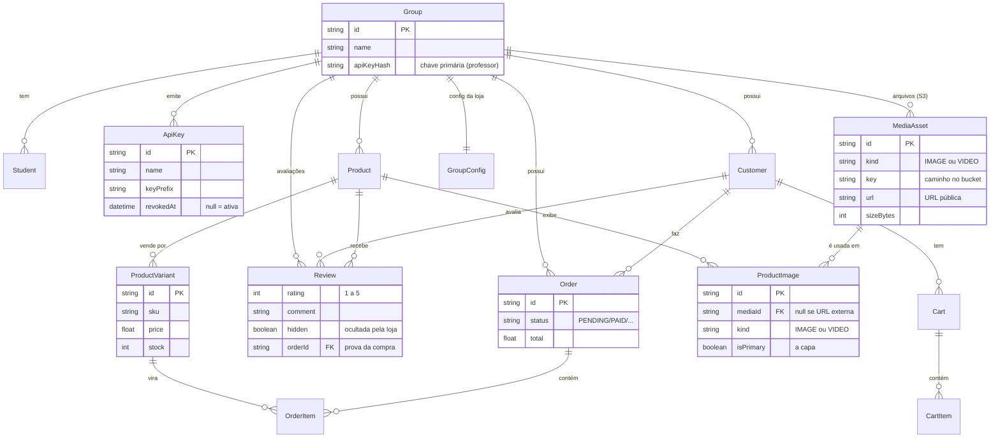

# Modelo de dados

As entidades centrais e como se relacionam. Tudo pendura em **`Group`** (o tenant).

## Leitura rápida

- **`Group`** é o centro: alunos, chaves, produtos, clientes e pedidos são todos _dele_.
- **`ProductVariant`** é a **unidade vendável** — carrega `sku`, `price` e `stock`, e é o
  que vira `OrderItem`.
- **`ApiKey`** guarda só o **hash**; `revokedAt = null` significa chave ativa. Convive com
  a `Group.apiKeyHash` (a chave primária criada pelo professor).
- **`Review`** é a avaliação do cliente: nota, comentário e fotos. O `orderId`
  é a **prova da compra** — é ele que acende o selo "compra verificada". Ocultar
  (`hidden`) tira da vitrine e da média, sem apagar o registro.
- **`MediaAsset`** é o **arquivo** na biblioteca da loja (o binário vive no S3, aqui fica o
  ponteiro); **`ProductImage`** é o **vínculo** desse arquivo com um produto ou variante.
  Por isso a mesma foto pode aparecer em vários produtos, e tirar a foto de um produto não
  apaga o arquivo.
- **`GroupConfig`** guarda a configuração da loja (identidade, contato, tema, regional).

:::note Isolamento na prática
Nenhuma dessas tabelas é consultada sem o filtro de `groupId` (via `tenantScope`). É isso
que garante que um grupo nunca leia dados de outro.
:::
