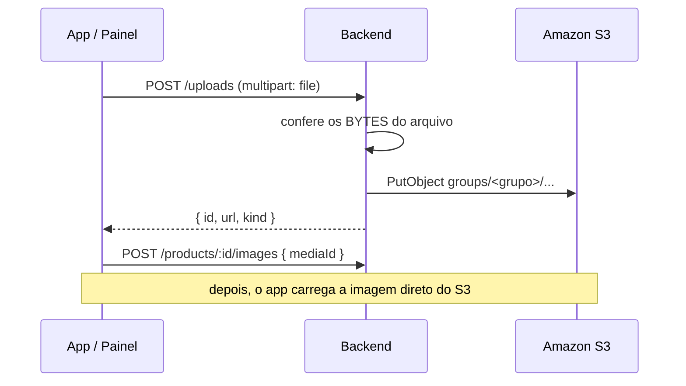

import Tabs from '@theme/Tabs';
import TabItem from '@theme/TabItem';

# Fotos e vídeos dos produtos

O arquivo sobe para a **API** em `multipart/form-data`; ela guarda no **Amazon S3** e
devolve uma **URL pública** que não expira. É essa URL que vai no `<Image />` do app —
o arquivo nunca volta pela API, o celular baixa direto do bucket.



## O caminho curto: subir e vincular de uma vez

Uma chamada só, quando você já sabe de qual produto a foto é:

<Tabs>
<TabItem value="rn" label="React Native" default>

```ts
// expo-image-picker devolve uma uri local; o FormData do RN aceita { uri, name, type }
const r = await ImagePicker.launchImageLibraryAsync({ mediaTypes: ['images'] });
const foto = { uri: r.assets[0].uri, name: 'foto.jpg', type: 'image/jpeg' };

const form = new FormData();
form.append('file', foto as any);
form.append('isPrimary', 'true');       // vira a capa do produto

const res = await fetch(`${BASE}/products/${produtoId}/media`, {
  method: 'POST',
  headers: { 'X-API-Key': API_KEY },    // repare: sem Content-Type
  body: form,
});
const midia = await res.json();
```

</TabItem>
<TabItem value="web" label="Web (input file)">

```ts
const input = document.querySelector('input[type=file]') as HTMLInputElement;
const form = new FormData();
form.append('file', input.files[0]);
form.append('isPrimary', 'true');

const res = await fetch(`${BASE}/products/${produtoId}/media`, {
  method: 'POST',
  headers: { 'X-API-Key': API_KEY },
  body: form,
});
```

</TabItem>
<TabItem value="curl" label="curl">

```bash
curl -X POST "$BASE/products/$PRODUTO_ID/media" \
  -H "X-API-Key: sk_live_..." \
  -F "file=@foto.jpg" \
  -F "isPrimary=true"
```

</TabItem>
</Tabs>

:::danger O erro nº 1 do upload
**Nunca** defina `Content-Type` na mão numa requisição com `FormData`. O `fetch` precisa
gerar o `boundary` sozinho; se você fixar `'Content-Type': 'multipart/form-data'`, o
servidor não consegue separar as partes e o upload quebra.
:::

## O caminho longo: biblioteca de mídia

Útil quando a mesma foto serve a vários produtos, ou quando o arquivo sobe antes de o
produto existir (é assim que o painel do aluno funciona).

```ts
// 1) sobe para a biblioteca da loja
const media = await api.media.upload(foto, { folder: 'produtos' });
// → { id: "...", url: "https://...", kind: "IMAGE", mimeType, sizeBytes }

// 2) vincula onde quiser, quantas vezes quiser
await api.products.addImage(produtoId, { mediaId: media.id, isPrimary: true });
await api.products.addImage(outroProduto, { mediaId: media.id });
```

A mesma rota aceita `url` no lugar de `mediaId` se a imagem estiver hospedada fora
(`{ "url": "https://exemplo.com/foto.jpg" }`).

## Imagens e vídeos na resposta do produto

Vídeo usa o **mesmo** endpoint e o mesmo campo `file`. No `GET /products/:id` eles vêm
separados, então o carrossel não recebe um vídeo por engano:

```ts
const prod = await api.products.get(produtoId);
prod.images;   // só imagens  → carrossel
prod.videos;   // só vídeos   → player
prod.images.find((i) => i.isPrimary);  // a capa
```

Na **listagem** (`GET /products`), o campo `image` já traz a URL da capa, pronta para o
card.

## A capa

A **primeira imagem** enviada vira a capa (`isPrimary: true`) — é ela que aparece na
listagem do app. Vídeo nunca vira capa sozinho. Para trocar depois:

```bash
curl -X PATCH "$BASE/images/$IMAGE_ID" \
  -H "X-API-Key: sk_live_..." -H "Content-Type: application/json" \
  -d '{"isPrimary": true}'
```

:::tip `imageId` ≠ `mediaId`
O `id` que vem em `prod.images[]` é o **vínculo** da mídia com aquele produto; o `mediaId`
é o **arquivo** na biblioteca. Apagar o vínculo (`DELETE /images/:id`) tira a foto do
produto mas mantém o arquivo; apagar a mídia (`DELETE /media/:id`) remove o arquivo do S3.
:::

## O que a API recusa

| Situação | Status | Por quê |
|---|---|---|
| Arquivo que não é imagem nem vídeo | `415` | O tipo é conferido pelos **bytes** do arquivo — renomear `.pdf` para `.jpg` não engana |
| Arquivo acima do limite | `413` | A mensagem traz o limite em MB |
| Loja sem espaço | `422` | Cada loja tem uma cota; veja em `GET /media/usage` |
| Apagar mídia em uso | `409` | Use `DELETE /media/:id?force=true` para apagar mesmo assim |
| Upload não configurado | `503` | O ambiente está sem bucket (`UPLOAD_DISABLED`) — avise o professor |

Formatos aceitos: **JPEG, PNG, WebP, GIF, AVIF, MP4, WebM e MOV**.

## Quanto espaço ainda tenho?

```ts
const uso = await api.media.usage();
// { files, usedBytes, quotaBytes, availableBytes, usedPercent, maxFileBytes, acceptedMimeTypes }
```

Para liberar espaço, apague o que não está em uso:

```ts
const { data } = await api.media.list({ kind: 'IMAGE' });
await api.media.remove(data[0].id);
```

:::note Isolamento
Cada grupo só enxerga a própria biblioteca. No bucket, os arquivos ficam sob
`groups/<seu-grupo>/…`, e o nome do arquivo é sempre gerado pela API — o nome que você
enviou fica guardado só para exibição.
:::

## No painel do aluno

Se preferir clicar em vez de programar, o painel já faz tudo isso:

- **Produtos → (novo/editar) → Fotos e vídeos**: arraste os arquivos, clique na estrela
  para escolher a capa, na lixeira para remover.
- **Loja → Dados da loja**: envio do logo.
- **Loja → Armazenamento**: espaço usado e a lista de arquivos enviados, para apagar o
  que sobrou.
